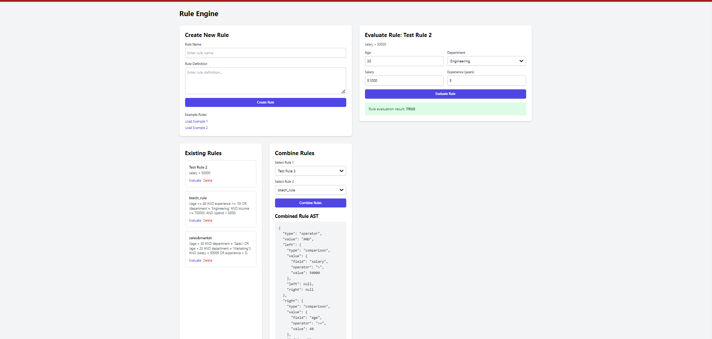

# Rule Engine with AST

A **3-tier rule engine application** built using the **MERN stack** to determine user eligibility based on attributes like age, department, income, and spend. The system represents rules using an **Abstract Syntax Tree (AST)**, allowing dynamic creation, combination, and modification of rules.

## Table of Contents
- [Overview](#overview)
- [preview](#Preview)
- [Features](#features)
- [Data Structure](#data-structure)
- [API Endpoints](#api-endpoints)
- [Installation](#installation)
- [Usage](#usage)
- [Example Rules](#example-rules)
- [Contributing](#contributing)
- [Dependencies](#Dependencies)

## Overview
This project implements a simple rule engine that evaluates user eligibility based on attributes like age, department, income, and spend. Rules are expressed using an **Abstract Syntax Tree (AST)**, which allows flexible manipulation of rules at runtime.

## Preview

Here’s a preview of the application:



Users can:
- Create rules from strings that represent conditions.
- Combine rules to create more complex eligibility criteria.
- Evaluate a user's attributes against the combined rules to determine if they are eligible.

## Features
- **AST Representation**: Uses AST to represent conditional rules and dynamically create or modify them.
- **Rule Evaluation**: Determines user eligibility based on defined rules.
- **API Design**: RESTful API for creating, combining, and evaluating rules.
- **Data Persistence**: Stores rule data and application metadata in MongoDB.
- **Error Handling**: Validates and manages errors for invalid rule structures and data formats.

## Data Structure
The AST is represented by the following data structure:

```json
{
  "type": "operator", // "operator" or "operand"
  "value": "AND" | "OR" | <operator>, // the operation or condition
  "left": <Node>, // reference to the left child (for operators)
  "right": <Node>, // reference to the right child (for operators)
  "value": <optional operand> // only for operand nodes (e.g., a comparison value)
}
```
## API Endpoints

**1. Create a Rule**

``POST /api/rules``

**Description:**  Takes a rule string and returns the AST representation.

**Payload:**
``
{
  "rule_string": "age > 30 AND department = 'Sales'"
}
``
**Response:**
``
{
  "ast": {
    "type": "operator",
    "value": "AND",
    "left": { "type": "operand", "value": { "attribute": "age", "operator": ">", "value": 30 } },
    "right": { "type": "operand", "value": { "attribute": "department", "operator": "=", "value": "Sales" } }
  }
}
``

**2. Combine Rules**

``POST /api/rules/combine``

**Description:**  Combines multiple rules into a single AST.

**Payload:**

``{
  "rules": ["rule1_ast", "rule2_ast"]
}``

**Response:**

``{
  "combined_ast": { ... }
}
``

**3. Evaluate Rule**

``POST /api/rules/evaluate``

**Description:** Evaluates a user's data against the given rule AST.

**Payload:**

``{
  "data": { "age": 35, "department": "Sales", "salary": 60000 },
  "ast": { ... } // rule AST
}``

**Response:**

``{
  "isEligible": true
}``

## Installation

**Clone the repository:**

``git clone  https://github.com/Mohammed-Nusaif/Logic-Flow.git``

``cd logicflow``

**Install backend dependencies:**

``cd rul_engine_API``

``npm install``

**Install frontend dependencies:**

``cd ../logicflow``

``npm install``

Setup MongoDB: Ensure you have MongoDB running. Configure the MongoDB connection string in rule_engine_API/config/config.js.

**Run the application:**

**Start the backend:**

``cd rule_engine_API``

``npm run start``

**Start the frontend:**

``cd ../logicflow``

``npm start``
## Usage

**Example 1:**  Creating and Evaluating Rules

_**Create a Rule:**_ Use the /api/rules endpoint to create a rule.

_**Evaluate the Rule:**_ Post some user data to the /api/rules/evaluate endpoint to check if the user is eligible based on the rule.

**Example 2:**  Combining Rules
You can combine two or more rules to form a more complex decision tree.

## Example Rules

**Rule 1:**

``"((age > 30 AND department = 'Sales') OR (age < 25 AND department = 'Marketing')) AND (salary > 50000 OR experience > 5)"``

**Rule 2:**

``"((age >= 40 AND experience >= 10) OR (department = 'Engineering' AND income >= 70000)) AND (spend < 5000)"``

## Contributing

Feel free to open issues and submit pull requests. For major changes, please open a discussion first to discuss what you would like to change.

## Dependencies

The following dependencies are used in this project:

### Backend (Node.js/Express/MongoDB)
- **Express**: Fast, unopinionated, minimalist web framework for Node.js.
- **Mongoose**: Elegant MongoDB object modeling for Node.js.
- **Cors**: Middleware to enable Cross-Origin Resource Sharing (CORS).
- **Body-Parser**: Middleware to parse incoming request bodies in a middleware.

### Frontend (React)
- **React**: A JavaScript library for building user interfaces.
- **React Router**: Declarative routing for React applications.
- **Axios**: Promise-based HTTP client for making API requests.

### Styling
- **Tailwind CSS**: A utility-first CSS framework for rapid UI development.

### Dev Tools
- **Nodemon**: A tool that automatically restarts the node application when file changes are detected.
- **Concurrently**: Runs multiple commands concurrently.

### Additional Utilities
- **Dotenv**: Loads environment variables from a `.env` file.


